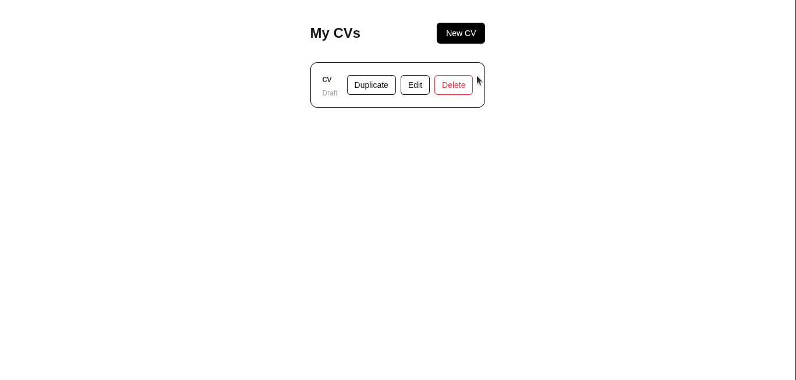
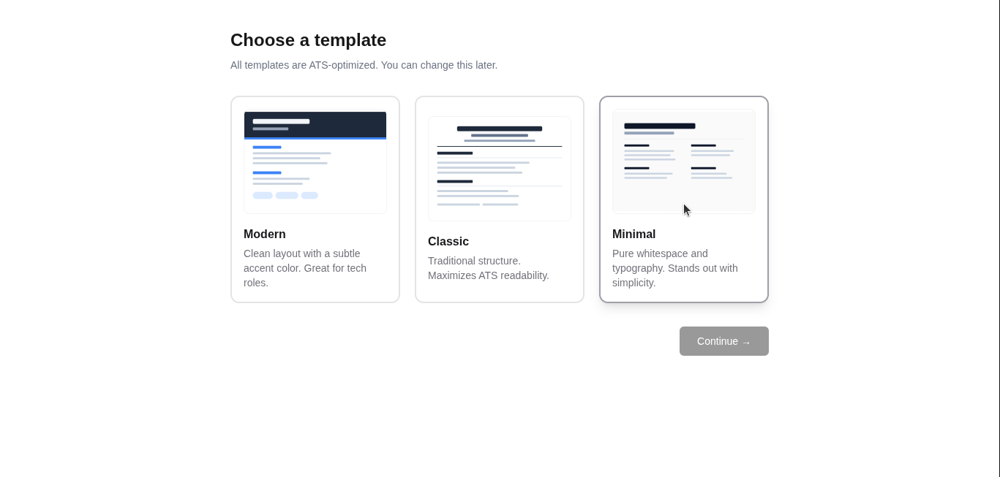
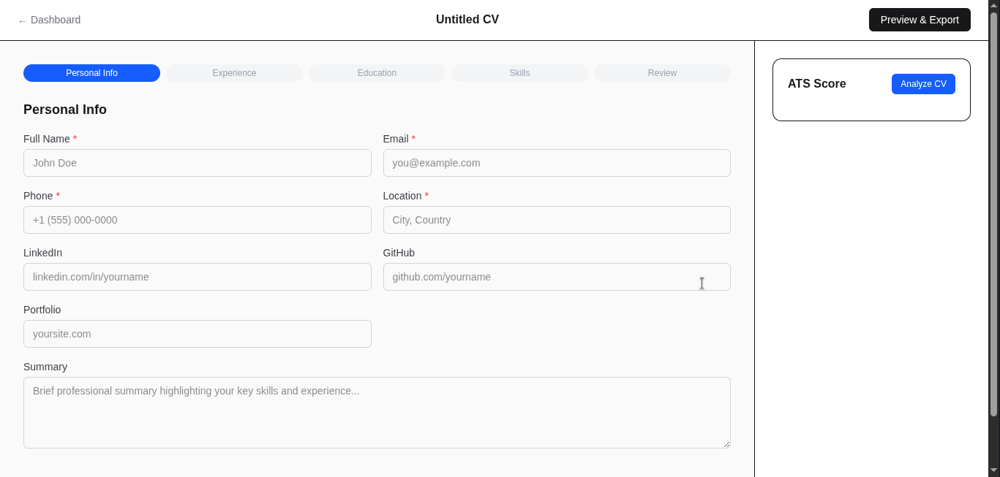
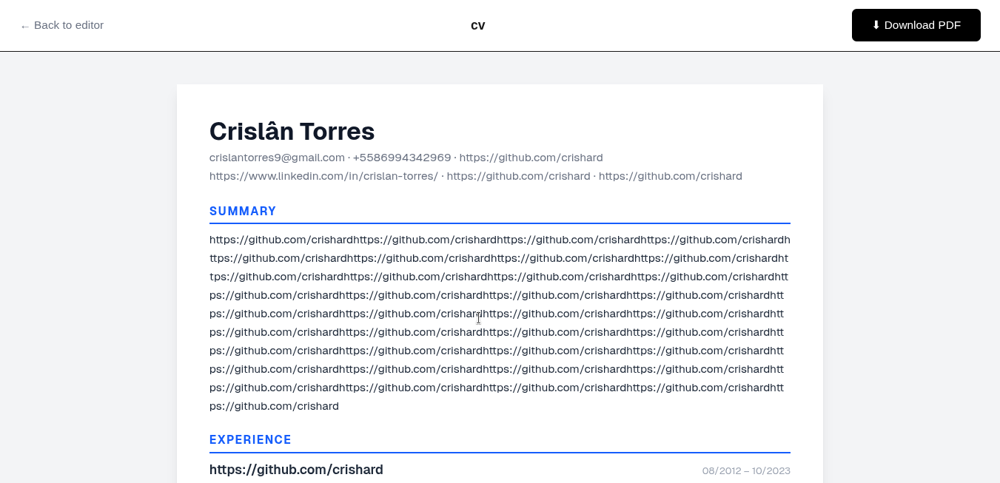

# CVForge — ATS-Optimized CV Generator with AI

> An intelligent CV builder that helps professionals create ATS-compliant resumes using AI-powered content suggestions and real-time optimization scoring.


---

## Screenshots

### Dashboard


### Template Selection


### CV Editor


### Preview & Export


---

## Overview

CVForge solves a critical problem for job seekers: most resumes fail to pass Applicant Tracking Systems (ATS) before a human ever reads them. This application combines professional CV templates designed specifically for ATS compatibility with AI to help users write stronger, keyword-optimized content.

**Key differentiators:**
- Templates engineered for ATS parsing (no tables, columns, or graphics in critical fields)
- AI assistant that rewrites experience bullets using action-verb + impact format
- Real-time ATS Score with actionable improvement suggestions
- Autosave every 3 seconds so no work is lost

---

## Features

| Feature | Description |
|---|---|
| Template Gallery | 3 ATS-compliant templates (Modern, Classic, Minimal) |
| Step-by-step Editor | Guided wizard across 5 sections with autosave |
| AI Enhancement | Rewrites summaries and experience bullets |
| ATS Score | 0–100 score with breakdown and fix suggestions |
| PDF Export | Server-side PDF generation with text-selectable output |
| Auth | Email/password registration |

---

## Tech Stack

| Layer | Technology |
|---|---|
| Framework | Next.js 15 (App Router) |
| UI | React + Tailwind CSS |
| ORM | Prisma 5 |
| Database | PostgreSQL (Supabase) |
| AI | OpenRouter (Gemini 2.0 Flash / Llama 3.3 70B) |
| Auth | NextAuth.js v5 |
| PDF | Puppeteer + @sparticuz/chromium-min |
| Testing | Vitest + React Testing Library |
| Deploy | Vercel |

---

## Architecture

```
src/
├── app/
│   ├── (auth)/             # Login, Register
│   ├── (dashboard)/
│   │   ├── dashboard/      # CV list
│   │   └── cv/
│   │       ├── new/        # Template selection
│   │       └── [id]/
│   │           ├── edit/   # Step-by-step editor
│   │           └── preview/
│   └── api/
│       ├── auth/
│       ├── cv/             # CRUD + PATCH title
│       ├── ai/
│       │   ├── enhance/    # Rewrite text with AI (streaming)
│       │   ├── generate/   # Generate bullets / skills
│       │   └── ats-score/  # ATS analysis
│       └── export/pdf/
├── components/
│   ├── cv-editor/
│   │   ├── steps/          # Wizard steps (PersonalInfo, Experience…)
│   │   ├── CVEditorShell   # Header + autosave + title management
│   │   └── ai-assistant/   # ATS Score panel
│   ├── templates/          # ModernTemplate, ClassicTemplate, MinimalTemplate
│   └── ui/
├── lib/
│   ├── openrouter.ts       # AI client with free model fallback chain
│   ├── prisma.ts
│   ├── pdf.ts
│   ├── cv-to-html.ts       # HTML generator for PDF
│   └── rate-limit.ts
└── types/cv.ts
```

---

## Data Model

```
User ──< CV
          │
          └── data: JSON (CVData)
                ├── personalInfo
                ├── experience[]
                ├── education[]
                ├── skills
                ├── certifications[]
                └── projects[]
```

---

## Getting Started

```bash
git clone https://github.com/crishard/cv_app
cd cv_app
npm install
cp .env.example .env
npx prisma migrate dev
npm run dev
```

**Required environment variables:**

```env
DATABASE_URL=
DIRECT_URL=
NEXTAUTH_SECRET=
NEXTAUTH_URL=
OPENROUTER_API_KEY=
```

---

## Functional Requirements

**Core:**
- Users can register, login, and manage multiple CVs
- Users select a template before editing
- CV editor guides the user through 5 sections with field validation
- Content autosaves every 3 seconds after last change
- CV title is editable inline and auto-updates from the user's first name

**AI:**
- Any text field can be enhanced by AI on demand (streaming response)
- ATS Score analyzes the full CV and returns a 0–100 rating with breakdown
- AI routes fall back across multiple free models automatically on rate limit

**Export:**
- CV is exported as a PDF with selectable text (ATS-readable)
- PDF is generated server-side for visual consistency

---

## Non-Functional Requirements

- ATS templates use single-column layout, standard fonts, no images in critical fields
- AI routes are rate-limited to 20 requests/minute per user
- AI responses stream to the UI for perceived performance
- All routes behind `/dashboard` require authentication

---

## Author

**Crislan** — [GitHub](https://github.com/crishard)

Built as a portfolio project demonstrating full-stack development with AI integration.
